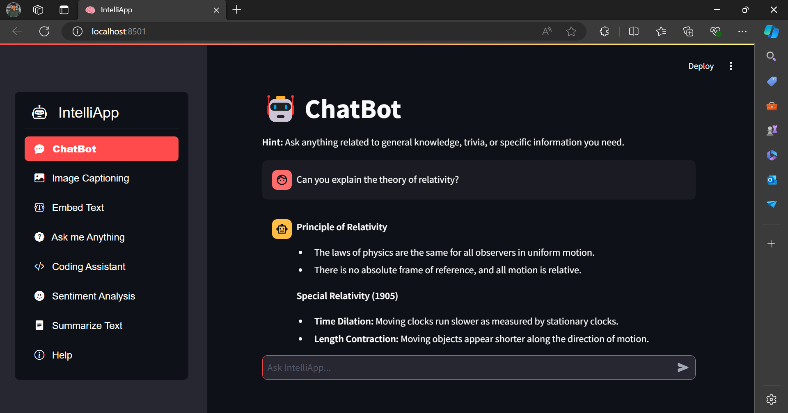
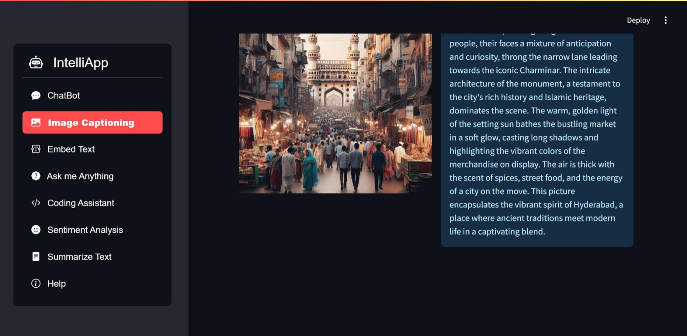
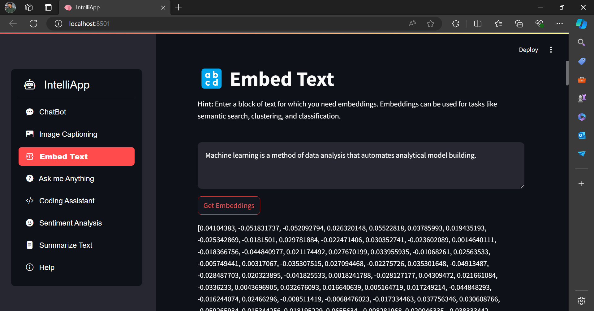
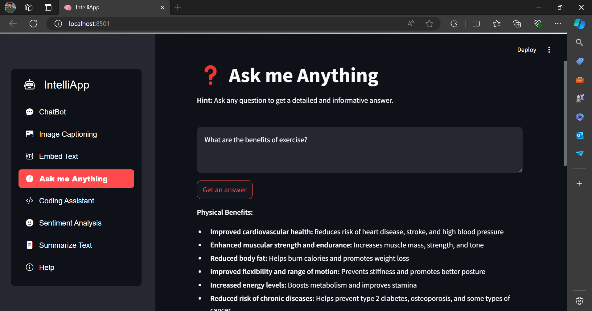
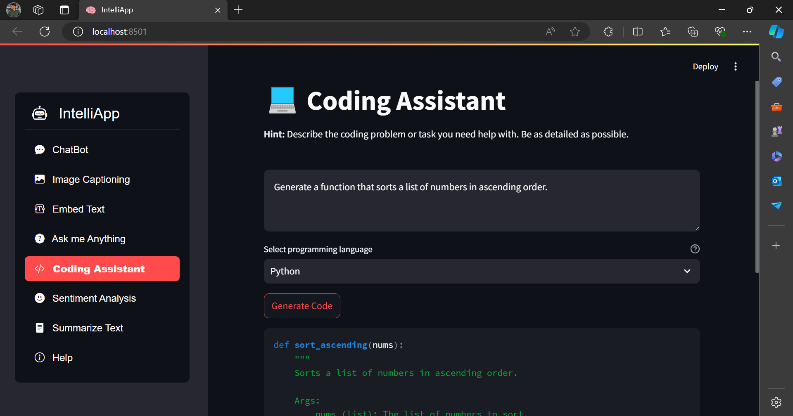
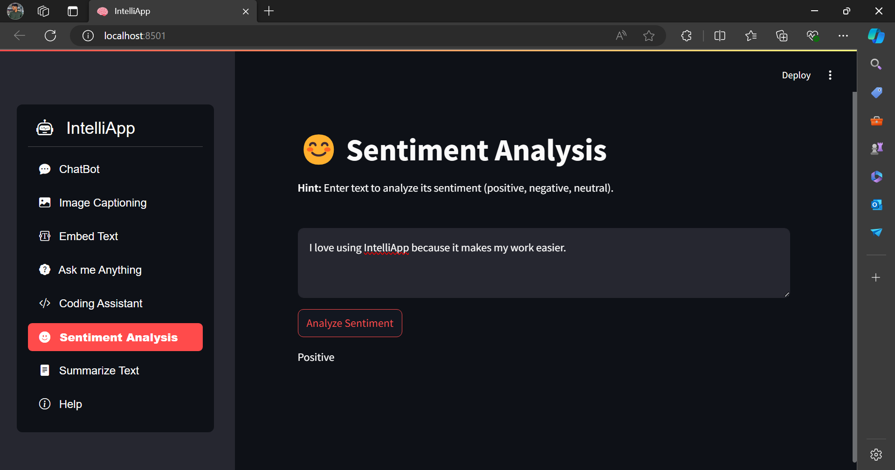
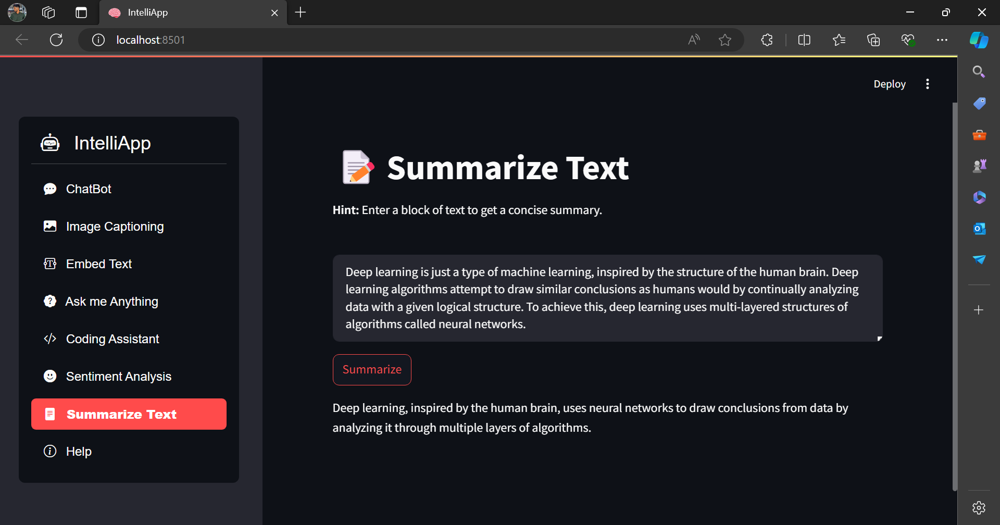
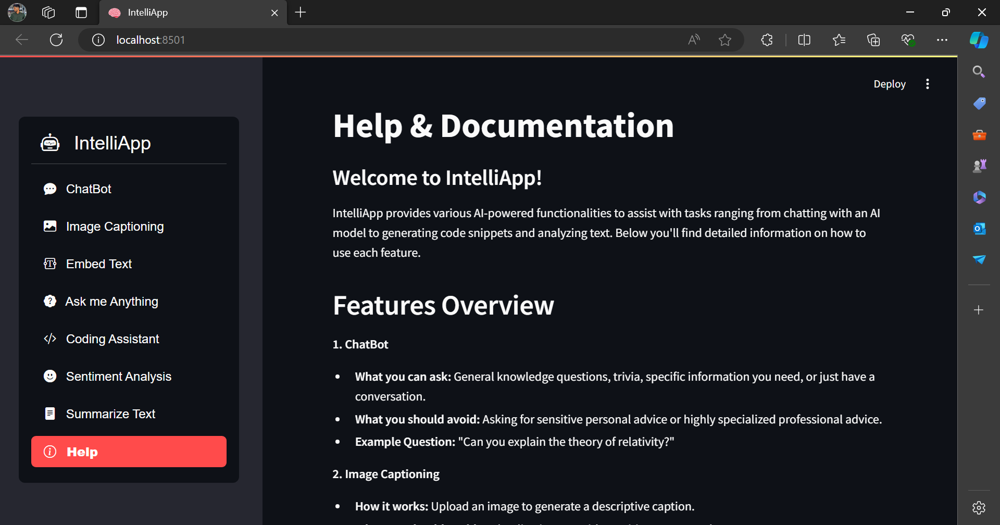

# IntelliApp

**IntelliApp** is an AI-powered web application built with Streamlit and Google’s Gemini models. It offers a variety of functionalities such as chatbot interactions, image captioning, text embedding, question answering, coding assistance, sentiment analysis, and text summarization. This README provides a comprehensive guide on how to set up, use, and contribute to IntelliApp.

## Features

- **ChatBot**: Interact with an AI chatbot for general knowledge, trivia, or information.
- **Image Captioning**: Upload an image to get a descriptive caption.
- **Embed Text**: Generate text embeddings for various NLP tasks.
- **Ask me Anything**: Get answers to any question you ask.
- **Coding Assistant**: Describe a coding task and receive a relevant code snippet.
- **Sentiment Analysis**: Analyze the sentiment of a block of text.
- **Summarize Text**: Obtain a concise summary of a block of text.

## Getting Started

### Prerequisites

- **Python**: Version 3.8 or higher
- **Virtual Environment**: Recommended
- **Google API Key**: Required for accessing Gemini models

### Installation

1. **Clone the Repository**

   ```bash
   git clone https://github.com/your-username/intelliapp.git
   cd intelliapp
   ```

2. **Create and Activate a Virtual Environment**

   ```bash
   python -m venv venv
   source venv/bin/activate  # Windows: `venv\Scripts\activate`
   ```

3. **Install Dependencies**

   ```bash
   pip install -r requirements.txt
   ```

### Configuration

1. **Create a Configuration File**

   In the root directory, create a `config.json` file:

   ```json
   {
     "GOOGLE_API_KEY": "your-google-api-key"
   }
   ```

2. **Set Up API Keys**

   Ensure your Google API key is valid and has access to the necessary models.

### Running the Application

Start the Streamlit application with:

```bash
streamlit run main.py
```

Access IntelliApp at **localhost:8501** in your browser.

**Deployed Version**: [IntelliApp Live](https://intelliapp.streamlit.app/)

## Usage

### ChatBot

- **Function**: Engage with the AI to ask questions or converse.
- **Input**: Type your query and press Enter.
- **Example**: "Explain the theory of relativity."



### Image Captioning

- **Function**: Upload an image to receive a caption.
- **Input**: Select an image file and click "Generate Caption."
- **Example**: Upload a photo of a beach.



### Embed Text

- **Function**: Generate text embeddings for analysis.
- **Input**: Enter text and click "Get Embeddings."
- **Example**: "Machine learning automates data analysis."



### Ask me Anything

- **Function**: Submit any question to get an answer.
- **Input**: Type your question and click "Get an answer."
- **Example**: "What are the benefits of exercise?"



### Coding Assistant

- **Function**: Describe a coding task and receive a code snippet.
- **Input**: Provide a task description, select a language, and click "Generate Code."
- **Example**: "Create a Python function to sort a list."



### Sentiment Analysis

- **Function**: Analyze the sentiment of a text.
- **Input**: Enter text and click "Analyze Sentiment."
- **Example**: "I am thrilled with the new features."



### Summarize Text

- **Function**: Get a summary of a block of text.
- **Input**: Enter text and click "Summarize."
- **Example**: "Summarize the benefits of IntelliApp."



### Help & Documentation


## Technical Details

### AI Models

**Gemini AI Models**: IntelliApp integrates Google’s Gemini models for various functions:

- **Gemini-1.5-Flash**: Used for generating responses, embeddings, and code snippets.
- **Gemini-1.5-Flash Vision**: Provides captions for images.

For more details, refer to [Google’s Generative AI Documentation](https://cloud.google.com/generative-ai).

## Contributing

1. **Fork the Repository**
2. **Create a Branch** for your changes.
3. **Commit Your Changes** and **Push** to your branch.
4. **Submit a Pull Request** with a description of your changes.

For major updates, open an issue to discuss proposed changes.

## Contact

For questions or support, email [saketh.engineer@gmail.com](mailto:saketh.engineer@gmail.com).

Thank you for using IntelliApp!
